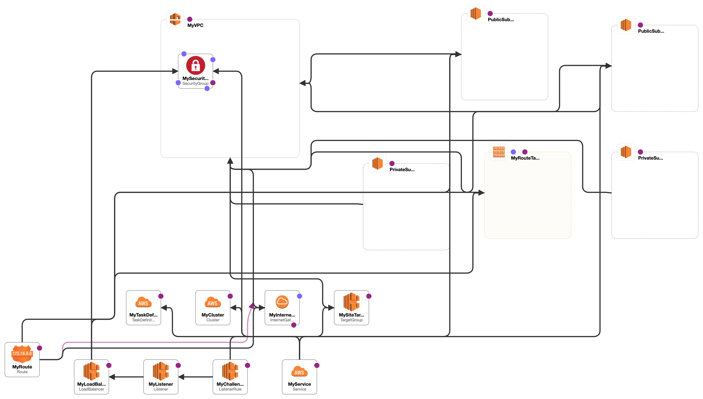

# DevOps challenge CloudFormation

For this challenge, I used a simple Docker image of a web page that you can easily find within the Docker registry by searching for: alesson23/site:v1

## Infrastructure Components:

- For this challenge, I used AWS + ECS Fargate for container orchestration

- An Application Load Balancer (ALB) to route traffic to containers.

- Amazon VPC for networking, with public and private subnets for ECS Fargate and ALB.

- Security groups to restrict traffic to and from containers.

- Network ACLs as needed for an additional layer of security.

- For high availability, all containers will be deployed in different availability zones.

- Autoscaling to ECS Fargate based on application load.

- CloudWatch to monitor key performance metrics.

## Prerequisites
- You must have an AWS Account
- You must have an AWS Key ID
- You must have an AWS Secret Access Key

## Execution
In this project we created a workflow using GitHub Actions, where all commits or merges carried out in the "main" branch will trigger a new deployment pipeline.
You can check the pipeline configuration files by navigating to: [.github/workflow/cloudformation.yaml](.github/workflow/cloudformation.yaml)

## Settings required to run the pipeline
Although the pipeline file is already configured, you will need to register two variables on your Github that will be referenced within this pipeline.
You can easily configure these variables by going to: **Settings > Secrets and Variables > Actions > Repository secrets > New repository secrets.**
You must create two variables, one named **AWS_ACCESS_KEY_ID** and the other named **AWS_SECRET_ACESS_KEY**.
The values of these variables must be obtained from your AWS account through the user with the correct permissions.

